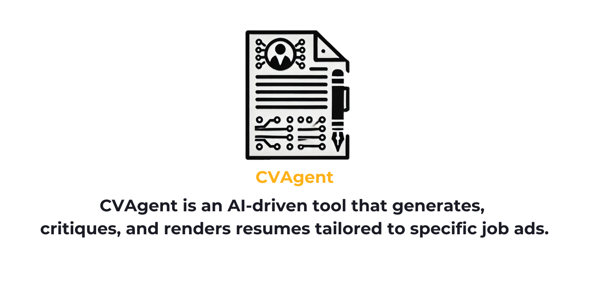
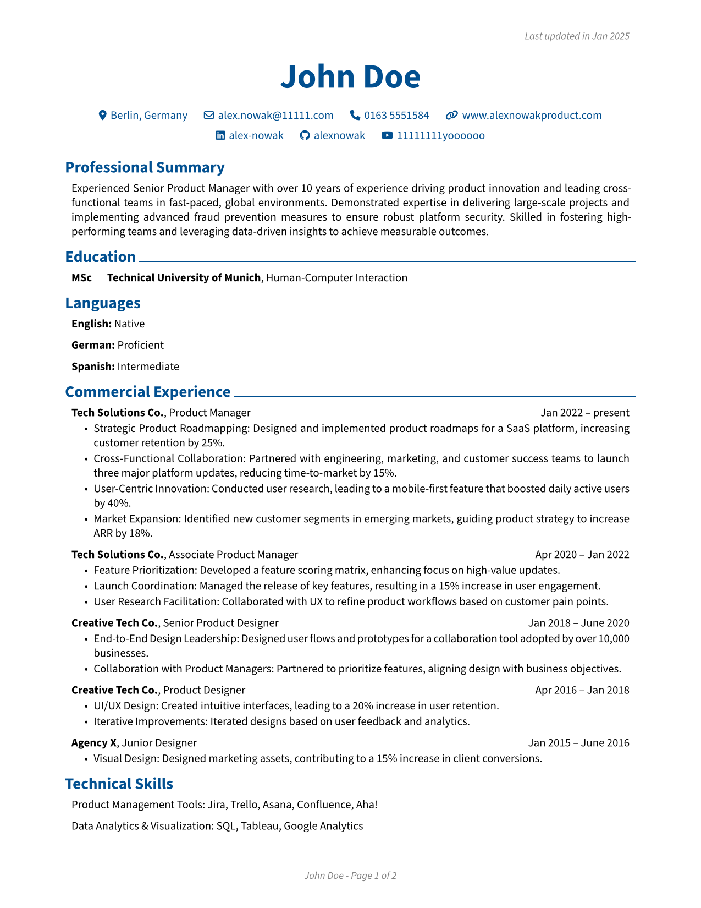

# CVAgent

Powered by **Autogen** and the **RenderCV** library, it refines user inputs and job requirements into a polished CV, saving time and ensuring alignment. Start building your next resume with ease.
---

## Table of Contents
1. [Prerequisites](#prerequisites)
2. [Installation](#installation)
3. [Configuration](#configuration)
4. [Usage](#usage)
5. [Output](#output)
6. [Contributing](#contributing)
7. [License](#license)

---

## Prerequisites
- [Python 3.13+](https://www.python.org/downloads/)
- [Poetry](https://python-poetry.org/docs/)

---

## Installation
1. **Clone the repository**:
   ```bash
   git clone https://github.com/yourusername/CVAgent.git
   cd CVAgent
   ```

2. **Install dependencies via Poetry**:
   ```bash
   poetry install
   ```

3. **Activate the virtual environment** (optional, but recommended):
   ```bash
   poetry shell
   ```

---

## Configuration
1. **Create a `.env` file** in the root folder to store your API key:
   ```ini
   OPENAI_API_KEY=your_api_key
   ```
   Replace `your_api_key` with your actual OpenAI API key.

---

## Usage
1. **Update the following files** according to your details:
   - `advert.txt` — The job advertisement you want to apply for.
   - `CV-experience.txt` — Your professional experience, including positions and key highlights.
   - `CV-personal.txt` — Your personal summary, education, contact details, and social platforms.
   - `CV-skills.txt` — Your skills, including both soft and technical skills.

2. **Run the main script**:
   ```bash
   poetry run python main.py
   ```
   If you have activated the virtual environment via `poetry shell`, you can also run:
   ```bash
   python main.py
   ```
3. **Cost Optimization**:
    The script is set up to use `4o-mini` for all agents, but it often gets stuck when generating YAML because the model is not sophisticated enough or the prompt is not good enough.
If this happens, simply change the `yaml_writer` agent to use the pre-configured `openai_model_4o_client`.
---

## Output
- By default, the generated PDF file is saved in the `render_output` folder (if AI won't change it).

---

## Contributing
Feel free to open issues or submit pull requests if you have any improvements or suggestions.
---

## License
This project is licensed under the [MIT License](LICENSE).
